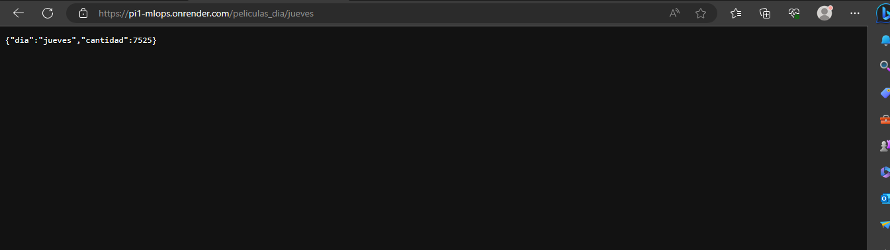

# <h1 align=center> **PROYECTO INDIVIDUAL N° 1** </h1>

## <h1 align=center>**`Machine Learning Operations (MLOps)`**</h1>

>## Bienvenido, en este repositorio te presento mi primer proyecto individual de la etapa de labs. 

>## Para ponerte en contexto, comencemos con una breve... 

 

## **Introducción**

### Te comparto algunas directrices iniciales que marcarán el rumbo del mismo.

 

    * Rol a desarrollar: "MLOps Engineer" de una start-up que provee servicios de agregación de plataformas de streaming.

    * Propósito: Solucionar un problema de negocio, creando un sistema de recomendación.

    * Propuesta de trabajo: 
                            - Transformaciones: llevar a cabo un trabajo de ingeniería de datos, que implique realizar el 
                                                modelado y la limpieza de los datos, utilizando las bases de datos proporcionadas.
                            - Desarrollo de una API: para disponibilizar los datos de la empresa utilizando el framework FastAPI.
                            - Deployment: Para que la API desarrollada pueda ser consumida desde la web por todos los usuarios.

 

## **Desarrollo**
### A lo largo de este proyecto observarás dos grandes etapas: la primera, donde cumpliendo con la tarea de **`Data Engineer`** realizo el proceso de ETL (Extracción,Transformación y Carga) de los datos; desarrollo desde cero una API usando el framework de [FastAPI](https://fastapi.tiangolo.com/es/) y realizo el Deploy de la misma a través de [Render](https://render.com/), una plataforma en la nube que proporciona un entorno integrado y fácil de usar para la creación, implementación y ejecución de aplicaciones y sitios web.

### Y la segunda, donde desarrollo herramientas de **`Machine Learning`** para crear un sistema de recomendación de películas, acompañado del correspondiente EDA (Análisis Exploratorio de los Datos).

 

>## **Proceso de ETL**
### Durante esta etapa, extraigo los datos desde su localización original: [Dataset_Original](https://drive.google.com/file/d/1Rp7SNuoRnmdoQMa5LWXuK4i7W1ILblYb/view?usp=sharing), para poder realizar su transformación y que puedan estar disponibles adecuadamente para su consumo por los distintos endpoints de la API. 
### Con respecto a las transformaciones realizadas, si visitas el archivo _PI1_ETL.ipynb_, podrás observarlas en mayor detalle. Mediante la utilización de `Python` y sus librerías como `pandas, numpy y ast` logré realizarlas y obtener un DataFrame limpio. 

  

 >## **Creación de la API**
 ### Para la creación de la API conté con la ayuda de la plataforma [FastAPI](https://fastapi.tiangolo.com/es/), la cual brinda una interfaz de visualización más amigable; permitiendo construir APIs rápidas y escalables en Python. Si visitas el archivo _main.py_ y/o _PI1_ETL.ipynb_, podrás observar en mayor detalle los distintos endpoints que desarrollé para ser consultados desde la interfaz. Con una descripción más detallada de cada endpoint. 

 

### Puedes visitar aquí la [API_Creada](https://pi1-mlops.onrender.com)
### Pero también te dejo la imagen del mensaje de bienvenida que encontratrás inicialmente.

 

 

### Además te dejo algunas de imágenes de distintas consultas realizadas. 

 

### https://pi1-mlops.onrender.com/peliculas_mes/enero, puedes cambiar el mes. 

 

### https://pi1-mlops.onrender.com/peliculas_mes/jueves, puedes cambiar el día.

 

### https://pi1-mlops.onrender.com/franquicia/Toy%20Story%20Collection, puedes cambiar la franquicia.

 

### https://pi1-mlops.onrender.com/retorno/Waiting%20to%20Exhale, puedes cambiar el título de la película.

 

>## **Análisis EDA**
### Durante este proceso realicé un análisis exploratorio de los datos, con el objetivo de comprenderlos mejor, para el desarrollo del modelo de machine learning. Si deseas, puedes visitar el archivo _PI1_EDA.ipynb_ para revisar dicho análisis.
### Luego creé un nuevo dataset, teniendo en cuenta los datos seleccionados a partir del análisis anteriormente mencionado, para ser consumido en las consultas de la API. 

 

>## **Sistema de Recomendación**
### El objetivo de esta funcionalidad es proporcionar recomendaciones de películas a los usuarios basándose en la similitud con otras películas. Se realiza un proceso de comparación y ordenamiento entre la película seleccionada y el conjunto completo de películas. El resultado se retorna en forma de un diccionario de Python que contiene la cantidad de cinco valores, cada uno de ellos representado por una cadena de texto. 

### Puedes visitar esta funcionalidad en la API https://pi1-mlops.onrender.com/recomendacion, colocando el nombre de la película de la cual deseas una recomendación similar.

 

### **Fuente de datos**
 + [Dataset](https://drive.google.com/file/d/1Rp7SNuoRnmdoQMa5LWXuK4i7W1ILblYb/view?usp=sharing): Archivo con los datos originalmente proporcionados.

 + [Diccionario de datos](https://docs.google.com/spreadsheets/d/1QkHH5er-74Bpk122tJxy_0D49pJMIwKLurByOfmxzho/edit#gid=0): Diccionario con algunas descripciones de las columnas disponibles en el dataset.

  

 ### **Material de apoyo**
 En este mismo repositorio podras encontrar algunos [links de ayuda](hhttps://github.com/HX-PRomero/PI_ML_OPS/raw/main/Material%20de%20apoyo.md).

